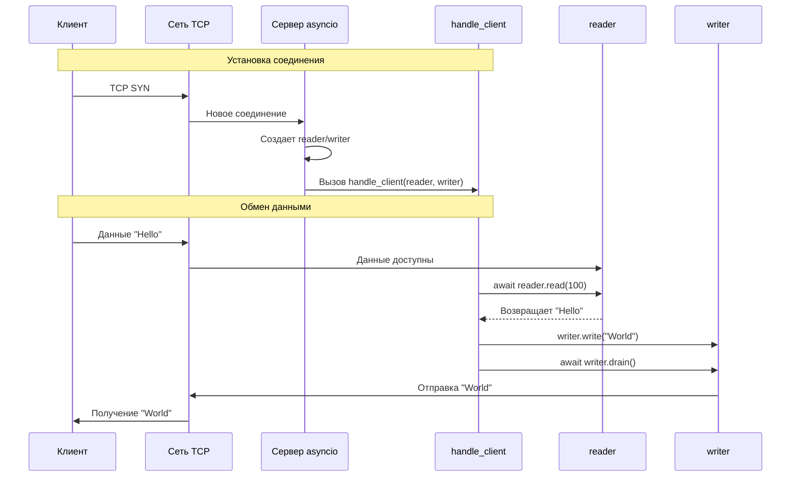

## Homework asyncio

## Откуда берутся reader и writer?

### 1. **Создание на сервере:**

```python
# Серверная сторона
server = await asyncio.start_server(
    broker.handle_client,  # ⬅️ Эта функция будет вызываться для КАЖДОГО нового клиента
    'localhost', 
    8888
)

# Когда подключается новый клиент, asyncio автоматически:
# 1. Принимает TCP-соединение
# 2. Создает пару (reader, writer) для этого соединения  
# 3. Вызывает handle_client(reader, writer) с этими объектами
```

### 2. **Создание на клиенте:**

```python
# Клиентская сторона
reader, writer = await asyncio.open_connection(
    'localhost', 
    8888
)
# ⬆️ Эта функция возвращает готовую пару (reader, writer)
```

## Что такое reader и writer?

### **StreamReader (`reader`)**
```python
class StreamReader:
    # Для ЧТЕНИЯ данных от другого конца соединения
    async def read(self, n): pass        # Прочитать n байт
    async def readline(self): pass       # Прочитать строку
    async def readexactly(self, n): pass # Прочитать точно n байт
```

### **StreamWriter (`writer`)**
```python
class StreamWriter:
    # Для ЗАПИСИ данных другому концу соединения
    def write(self, data): pass          # Записать данные в буфер
    async def drain(self): pass          # Дождаться отправки буфера
    def close(self): pass                # Закрыть соединение
    def get_extra_info(self, name): pass # Получить информацию о соединении
```

## Визуализация процесса:



## Подробное объяснение жизненного цикла:

### **Фаза 1: Создание сервера**
```python
async def main():
    # 1. Создаем сервер
    server = await asyncio.start_server(
        broker.handle_client,  # ⬅️ Функция-обработчик
        'localhost', 
        8888
    )
    
    # 2. Запускаем бесконечный цикл принятия соединений
    await server.serve_forever()
```

### **Фаза 2: Подключение клиента**
```
Клиент подключается → asyncio принимает соединение → 
Создает (reader, writer) → Вызывает handle_client(reader, writer)
```

### **Фаза 3: Обработка соединения**
```python
async def handle_client(self, reader, writer):
    # reader - для чтения данных ОТ этого клиента
    # writer - для записи данных ЭТОМУ клиенту
    
    while True:
        # Читаем данные от клиента
        data = await reader.read(100)
        # Обрабатываем данные...
        # Отправляем ответ клиенту
        writer.write(response)
        await writer.drain()
```

## Практический пример с аналогами:

### **Аналог с обычными сокетами:**
```python
# Обычные сокеты (синхронные)
import socket

def handle_client_connection(client_socket):
    # client_socket - как комбинация reader + writer
    data = client_socket.recv(1024)  # аналог reader.read()
    client_socket.send(response)      # аналог writer.write()
```

### **Асинхронный вариант:**
```python
# Asyncio (асинхронные)
async def handle_client(reader, writer):
    data = await reader.read(1024)    # ⏸️ Не блокирует другие задачи
    writer.write(response)            # 📤 Пишет в буфер
    await writer.drain()              # ⏸️ Ждет отправки без блокировки
```

## Как работают несколько клиентов одновременно:

```python
# Когда подключены 3 клиента:

# Клиент 1: reader1, writer1 → выполняется await reader1.read()
# Клиент 2: reader2, writer2 → выполняется await reader2.read()  
# Клиент 3: reader3, writer3 → выполняется await reader3.read()

# Event Loop переключается между ними:
# 1. Клиент1 отправил данные → продолжается handle_client
# 2. Клиент2 отправил данные → переключается на handle_client для клиента2
# 3. Клиент3 отправил данные → переключается на handle_client для клиента3
```

## Полный пример с комментариями:

```python
import asyncio
import json

class SimpleBroker:
    def __init__(self):
        self.queues = {}
        self.subscribers = {}
        
    async def handle_client(self, reader, writer):
        """Вызывается автоматически для каждого нового клиента"""
        # 📍 asyncio передает нам reader/writer для этого конкретного соединения
        addr = writer.get_extra_info('peername')
        print(f"Новый клиент: {addr}")
        
        try:
            while True:
                # ⏸️ Ждем данные ОТ этого клиента (не блокируя других)
                data = await reader.read(100)
                
                if not data:  # Клиент отключился
                    break
                    
                # 📨 Обрабатываем полученное сообщение
                message = json.loads(data.decode())
                await self.process_message(message, writer)
                
        except Exception as e:
            print(f"Ошибка с клиентом {addr}: {e}")
        finally:
            # 🚪 Закрываем соединение с ЭТИМ клиентом
            writer.close()
            print(f"Клиент {addr} отключен")

# Клиентский код:
async def example_client():
    """Пример как клиент получает свои reader/writer"""
    # 📞 Клиент сам создает соединение и получает reader/writer
    reader, writer = await asyncio.open_connection('localhost', 8888)
    
    # Теперь можно общаться с сервером:
    message = {'action': 'publish', 'topic': 'test', 'message': 'Hello'}
    writer.write(json.dumps(message).encode())
    await writer.drain()  # ⏸️ Ждем отправки
    
    # Читаем ответ от сервера:
    data = await reader.read(100)  # ⏸️ Ждем ответа
    
    writer.close()  # 📞 Закрываем соединение
```

## Итог:

- **`reader`**, **`writer`** создаются автоматически **asyncio** при установке TCP-соединения
- **Сервер** получает их когда клиент подключается к `start_server()`
- **Клиент** создает их при вызове `open_connection()`
- Каждая пара `(reader, writer)` представляет **одно уникальное соединение**
- **`reader`** - только для чтения данных от этого клиента
- **`writer`** - только для записи данных этому клиенту

# Домашнее задание: Асинхронный брокер сообщений

## 📋 Задание 1: Базовый функционал (обязательное)

### Цель: Закрепить понимание асинхронного программирования и работы с сокетами

**Задача:** Доработать предоставленный код брокера сообщений, добавив следующие функции:

```python
# 1. Добавить метод для просмотра всех топиков
async def list_topics(self, writer):
    # Должен возвращать список всех существующих топиков
    pass

# 2. Добавить метод для проверки количества сообщений в топике  
async def queue_length(self, topic, writer):
    # Должен возвращать количество сообщений в указанном топике
    pass

# 3. Добавить метод очистки топика
async def clear_topic(self, topic, writer):
    # Должен удалять все сообщения из указанного топика
    pass
```

**Требования:**
- Все методы должны быть асинхронными
- Клиент должен отправлять JSON-запросы вида:
  ```json
  {"action": "list_topics"}
  {"action": "queue_length", "topic": "news"}
  {"action": "clear_topic", "topic": "news"}
  ```
- Сервер должен возвращать соответствующие ответы

## 📋 Задание 2: Обработка ошибок (обязательное)

**Задача:** Добавить обработку ошибок в следующие сценарии:

1. **Некорректный JSON** - клиент отправляет невалидный JSON
2. **Отсутствующий топик** - клиент запрашивает топик, которого не существует
3. **Отсутствующее действие** - клиент отправляет неизвестное действие
4. **Отсутствующие поля** - в запросе не хватает обязательных полей

**Пример обработки:**
```python
try:
    message = json.loads(data.decode())
except json.JSONDecodeError:
    response = {'status': 'error', 'message': 'Invalid JSON format'}
    writer.write(json.dumps(response).encode())
    await writer.drain()
```

## 📋 Задание 3: Улучшение клиента (обязательное)

**Задача:** Создать улучшенную версию клиента с меню:

```python
def show_menu():
    print("\n=== Message Broker Client ===")
    print("1. List topics")
    print("2. Subscribe to topic") 
    print("3. Publish message")
    print("4. Get message count")
    print("5. Clear topic")
    print("6. Exit")
```

**Функциональность:**
- Интерактивное меню с вводом номера команды
- Возможность вводить топики и сообщения с клавиатуры
- Автоматическое отображение входящих сообщений при подписке

## 🚀 Задание 4: Дополнительные функции (повышенной сложности)

### Вариант A: Приоритет сообщений
```python
# Добавить поддержку приоритетов сообщений
message = {
    'action': 'publish',
    'topic': 'news',
    'message': 'Важное сообщение',
    'priority': 'high'  # high, normal, low
}
```

### Вариант B: TTL (Time To Live) для сообщений
```python
# Сообщения должны автоматически удаляться через указанное время
message = {
    'action': 'publish', 
    'topic': 'news',
    'message': 'Временное сообщение',
    'ttl': 60  # секунд
}
```

### Вариант C: Авторизация топиков
```python
# Добавить пароли для топиков
message = {
    'action': 'publish',
    'topic': 'private_news',
    'message': 'Секретное сообщение', 
    'password': 'secret123'
}
```

## 🎯 Задание 5: Тестирование (обязательное)

**Задача:** Написать тесты для брокера:

```python
import unittest
import asyncio

class TestMessageBroker(unittest.TestCase):
    async def test_publish_subscribe(self):
        # Тест публикации и подписки
        pass
    
    async def test_multiple_clients(self):
        # Тест работы с несколькими клиентами
        pass
    
    async def test_error_handling(self):
        # Тест обработки ошибок
        pass
```

**Требования:**
- Минимум 5 различных тестов
- Тестирование успешных сценариев
- Тестирование ошибочных сценариев

## 📝 Задание 6: Документация (обязательное)

**Задача:** Написать документацию к вашему брокеру:

1. **README.md** с описанием:
   - Как запустить сервер и клиент
   - Примеры использования
   - Описание протокола сообщений

2. **Комментарии** в коде для всех методов и классов

3. **Примеры** JSON-запросов и ответов

## 🏆 Критерии оценки

| Задание | Максимальный балл | Критерии |
|---------|-------------------|----------|
| 1. Базовый функционал | 3 балла | Работоспособность, корректность реализации |
| 2. Обработка ошибок | 2 балла | Полнота обработки, корректные ответы |
| 3. Улучшение клиента | 2 балла | Удобство использования, стабильность |
| 4. Дополнительные функции | 2 балла | Сложность реализации, полезность |
| 5. Тестирование | 2 балла | Полнота покрытия, работающие тесты |
| 6. Документация | 1 балл | Полнота, понятность, примеры |

## 💡 Пример решения (шаблон)

```python
# homework_broker.py
import asyncio
import json
from datetime import datetime, timedelta

class HomeworkBroker:
    def __init__(self):
        self.queues = {}
        self.subscribers = {}
        
    async def handle_client(self, reader, writer):
        addr = writer.get_extra_info('peername')
        print(f"Новый клиент: {addr}")
        
        try:
            while True:
                data = await reader.read(100)
                if not data:
                    break
                    
                await self.process_message(data, writer)
                
        except Exception as e:
            print(f"Ошибка: {e}")
        finally:
            writer.close()
    
    async def process_message(self, data, writer):
        try:
            message = json.loads(data.decode())
            action = message.get('action')
            
            if action == 'list_topics':
                await self.list_topics(writer)
            elif action == 'queue_length':
                await self.queue_length(message.get('topic'), writer)
            elif action == 'clear_topic':
                await self.clear_topic(message.get('topic'), writer)
            # ... остальные действия
            
        except json.JSONDecodeError:
            response = {'status': 'error', 'message': 'Invalid JSON'}
            await self.send_response(response, writer)
    
    async def list_topics(self, writer):
        # TODO: Реализовать
        topics = list(self.queues.keys())
        response = {'status': 'success', 'topics': topics}
        await self.send_response(response, writer)
    
    async def queue_length(self, topic, writer):
        # TODO: Реализовать
        pass
    
    async def clear_topic(self, topic, writer):
        # TODO: Реализовать  
        pass
    
    async def send_response(self, response, writer):
        writer.write(json.dumps(response).encode())
        await writer.drain()

# TODO: Реализовать остальные методы + клиент
```

## 📚 Рекомендуемые материалы для изучения

1. **Документация asyncio**: https://docs.python.org/3/library/asyncio.html
2. **Работа с сокетами**: https://docs.python.org/3/library/socket.html
3. **JSON в Python**: https://docs.python.org/3/library/json.html

## ⏰ Срок выполнения

**2 недели** с момента выдачи задания

